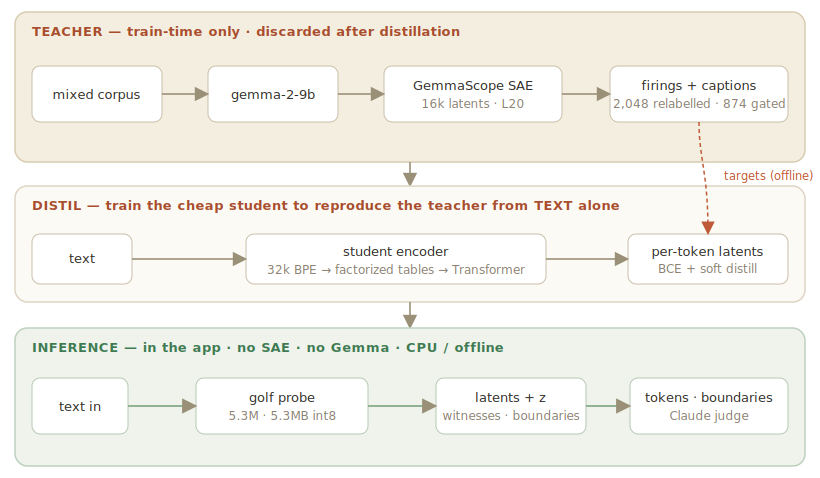
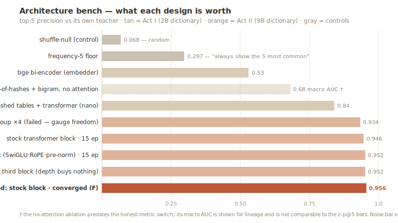
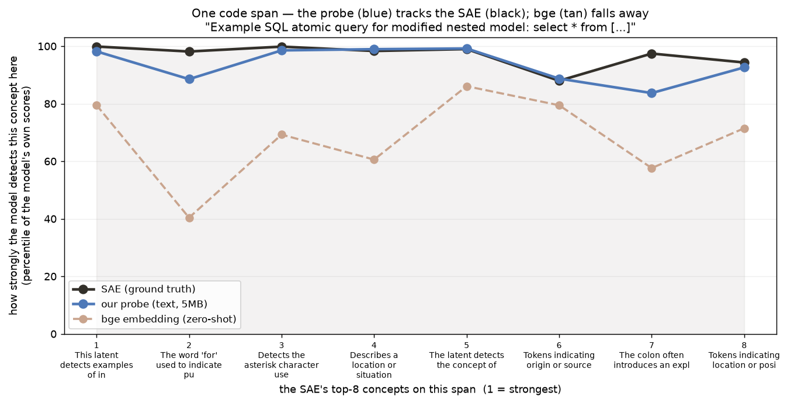

# One-shot SAE distillation: compressing a sparse autoencoder into a 5 MB text-only probe

*A BlueDot / MATS sprint. This page is the journey — edit it in `monitor_app/writeup.md`.*
*"One-shot" here means the SAE teacher is run **once**, offline, to teach a tiny student — which then reads text forever with no SAE and no base model. It does **not** mean new concepts can be added at inference without retraining.*

**What this project is, precisely:** we distil a Gemma-2-9B GemmaScope SAE into a tiny model using *parameter golf*, and we **quantify how well it recovers the SAE's concept detection against baselines** — random chance, a bge embedding model, and the SAE itself as ground truth — both in and out of distribution. That's the claim. A live monitoring app exists and is fun, but it's a *demonstration that the distilled probe runs cheaply*, not an evaluated safety system. One assumption is load-bearing and worth stating up front: **the SAE is the target, so every number here is fidelity to the SAE, not fidelity to ground truth** — the probe copies what the SAE does, inheriting its concepts and its errors.

## The idea

A **sparse autoencoder (SAE)** is the best concept-lens we have for a language model. It reads the model's internal activations and tells you which of thousands of human-interpretable concepts are active — "Python imports," "refusal," "harmful intent," "numbers." If you wanted to *watch a model think*, an SAE watching every activation would be ideal.

The problem is cost. To read an SAE you must run the full base model, capture its activation stream, and push it through the SAE — billions of parameters, a GPU, per token. Great in a research notebook, impossible as always-on infrastructure, and unavailable entirely for a closed model you can only see the *text* of.

So this project asks a different question. The usual move is *activations → a probe*. **The new move is: don't copy the activation path at all. Distill the SAE's *knowledge* into a model that goes text → concepts.** Run the SAE once, offline, to generate training labels; then train a tiny student that reads *text* and names the same concepts, with no SAE and no activations at inference. You lose the parts of the SAE that live purely in the internals and never reach the text — but you keep the large, text-expressible slice, in something small enough to run everywhere.

Why it can work: an SAE's concepts are, to a large degree, the same information an **embedding model** already captures from text. That's the thing we can measure and build on.

## Start simple — the embedding baseline

Before any custom model: can an off-the-shelf embedding model (`bge-small`) recover SAE concepts from text? Embed the text, compare it to each concept's caption, score by similarity. Zero-shot, no training.

It works a little — text genuinely carries SAE-concept signal — but it's weak: on our concepts it detects them only slightly better than a coin flip, and it's a 33 MB model. That's the floor. The question becomes: **how much better can a purpose-built, much smaller model do?**

## Parameter golf — a tiny transformer that copies more, for less

I built the student as a **parameter-golf** exercise: squeeze the most capability out of the fewest bytes. Each addition earned its place, and the story splits cleanly into *two* things — some additions bought **accuracy**, others bought **size**.

- **Hashed tokens** instead of a giant embedding table — tiny, and enough to start.
- **Self-attention** (a 2-layer transformer) — *this was the big accuracy jump.* Letting each word mean different things in different contexts is exactly what an SAE concept does; a bag of features can't. Accuracy went from barely-above-an-embedding to clearly-beating-it.
- **Its own 32 k tokenizer, factorized tables, an entropy-calibrated head, and a 13-parameter "smear gate"** replacing a million-parameter table — these barely moved accuracy but crushed the size: **22 M parameters → 5.3 MB**, at held-constant accuracy.

So the honest split: **attention set the accuracy; the golf ladder set the cost.** The result is a 5.3 MB model that scores text on a CPU at 10–25 k tokens/second — about 100× faster than the model that produced the text.

## It distills 2,000 labels — not one concept

A normal probe detects *one* thing (is this toxic? yes/no) and needs hand-labeled data for it. This student is different: it distills the SAE's **whole dictionary at once — 2,048 concepts — with no human labels**, because the SAE *is* the labeler. Run it once over a corpus, record which concepts fire, train the student to reproduce all of them.

The one place that needed care was the concept *names*. The SAE's stock captions are noisy, so a cheap 2026 model rewrote all 2,048 from witness examples, and a validator kept only the ones it could confirm — **874 passed a strict gate, for about 75 cents total.** (An accidental discovery: the concepts that passed the caption gate are also the ones the probe recovers best — the gate predicts recoverability.)

One thing the corpus decides, not the architecture: **which** concepts are covered. Trained on web-only text, the first version was blind on code; retrained on a code/reasoning/math/chat mix, the domain profile inverted — code 0.95, reasoning 0.97, and *web* became the weakest. Coverage is a corpus lever; accuracy and cost are architecture levers.

## How good is it, in plain words?

The SAE is the ground truth. Everything below is on held-out text the probe never trained on. One scope note first: **"close to the SAE" here means it detects the same concepts on the same text** — does it fire when the SAE fired? — *not* that it reproduces the SAE's exact internal magnitudes. It doesn't reproduce the full vector, and the last section says why. On the detection question, three plain measures:

**1. Does it pick the right top concepts?** When the probe lists the concepts it thinks are present, **19 of every 20 in its top 5 are real SAE firings.**

**2. Does the strength match?** As an illustration, take one span, the SAE's top concepts, and how strongly each model rates them (percentile of each model's own scores). On this span the probe (blue) tracks the SAE (black) closely and the embedding model (tan) falls away — the general version of this is measure 3 below.

**3. How many concepts does it recover — and how does that compare to the baselines?** This is the whole quantification in one figure. For every model, and every strictness bar you could set, what fraction of the SAE's 2,048 concepts clear it — random at 0.5, the SAE the target at 1.0. A higher line means more concepts detected well.

The probe's line is above every baseline everywhere: at a strict 0.8 bar, **~90% of the SAE's concepts clear it for the probe, versus ~55% for a *trained* bge head, ~40% for bag-of-words, and ~10% for zero-shot bge.** Its median per-concept detection is 0.90 (52% of concepts above 0.9, 99% above 0.7, none below 0.6) against 0.79 / 0.75 / 0.57 for the baselines. Concept by concept, the probe beats the trained bge head on **99%** of the 2,048 — it didn't memorize captions or lean on embedding proximity, it *learned the SAE's concept boundaries*.

And the honest ceiling: the probe does **not** reproduce the SAE's full activation *vector* — the SAE fires ~138 concepts per span, spread thinly, and matching all of them exactly isn't achievable from text or the point. It recovers the concepts that matter, per concept, well.

### Does it hold off-distribution?

The numbers above are on held-out documents from the *training corpus mix*. So we ran the real SAE on text from domains the probe never trained on — **medical abstracts and legal contracts** — to get fresh ground truth, and measured the same thing. The full stack (0.5 = coin flip, SAE = the target it's copying):

| on off-corpus medical + legal text | detection |
|---|---|
| random | 0.50 |
| bge embedding (naive) | 0.55 |
| **our probe** | **0.75** |
| SAE (ground truth) | 1.00 |

The probe softens from 0.90 to 0.75 — but **bge collapses to near-random (0.55), so the probe keeps essentially all of its lead**, beating the embedding model on **95% of concepts even off-distribution**, and its top-5 precision barely moves (0.94 — what it surfaces is still real).

And it doesn't degrade *uniformly* — it degrades in one interpretable direction. Half the concepts transfer intact (≥0.75), only 8% fail hard, and you can predict which from the caption alone:

- **Transfer** (near 1.0): universal structure and reasoning — "you" in direct address, questions, conditionals, comparison. They fire in any text.
- **Fail** (some *below* chance): concepts tied to an *absent* domain — Python `__init__`, LaTeX math, "systems of equations." Medical/legal text has no code or LaTeX, so the probe can't recover concepts it only ever saw in code. The below-chance cases ("let x =", "`is not`") are the sharpest: the probe learned those as code/math patterns, and in prose the same surface form means something else.

So off-distribution the probe fails *legibly* — universal concepts hold, domain-specific concepts break where their domain is gone — and keeps its full advantage over the naive baseline. That's graceful, predictable degradation, not collapse.

## Applications — demonstrated, not evaluated

The point of compressing the SAE is that the result *runs*: 5.3 MB, CPU, 10–25 k tokens/second, no activations. To show that concretely — **not to claim it works as a safety system** — the repo ships a live app. Because a proper safety-monitoring claim would need a threat model, realistic base rates, and adversarial inputs, none of which we evaluated, this section is a demonstration of the *capability to run cheaply*, and nothing more.

The app scores text live into concepts with per-token evidence and decision boundaries. The **Agents** tab illustrates the tiered pattern the compression makes possible: two agents work a task, the probe screens every message for ~$0 and ~100× faster than the agents produce it, and when a watched concept fires it hands that one span — with its firing evidence — to a live coding agent (Claude Code / Codex) or a Claude sentry to adjudicate. The probe classifies everything cheaply; a bigger model reviews only what's flagged. Whether that catches real misbehaviour is an open question and a separate project; what's shown here is only that the distilled probe is small and fast enough to sit in that loop.

**The probe classifies everything; a live agent reviews what matters.** This is the point of the whole design. The 5 MB probe is too small to *reason* about whether a refusal is justified or an action is safe — but it can label every span of every stream for free and flag the handful that hit a watched concept. Those flagged spans are then handed to a **live coding agent — Claude Code, Codex, or any local agent** — plugged straight into the loop: it reads the flagged span *and the probe's firing evidence* (which concept, which tokens) and adjudicates, edits, or blocks. The probe **routes attention**; the big model **decides**. So you get always-on, whole-stream observability at logging cost, with a capable reasoner spent only on the ~1% of spans that earned it — the tiered pattern that makes oversight of trillions of tokens actually affordable.

## Honest limits

- **Text-only ceiling.** It reads what surfaces in text; concepts that live purely in the model's internals are invisible to it. It's a concept monitor, not a deception detector.
- **Coverage is corpus-bound.** Only 2,048 of the SAE's 16,384 concepts were kept, and only 17 are safety-related — because the training corpus had little adversarial content, so those concepts fired too rarely to survive selection. The ones that *did* survive, the probe reads well (0.85). A safety-grade monitor is a targeted-corpus retrain away, not an architecture change.
- **Not a full SAE replica.** It copies the text-expressible slice, per concept, not the exact internal magnitudes. (The whole-vector match is only moderate — cosine 0.54 — because the SAE fires ~138 concepts per span, spread thinly; reproducing that superposition from text isn't the goal.)
- **Generalization is measured, in and out of distribution.** In-distribution numbers are a genuine held-out evaluation: the SAE scored the corpus once, we split *by document* (no leakage), and the probe was tested on documents it never saw against the real SAE's firings. (The SAE is deterministic, so those recorded firings *are* its live output — nothing cached.) Off-distribution is measured too (the "Does it hold off-distribution?" section): on medical + legal text the probe drops to 0.75 but keeps its full lead over the embedding baseline and fails legibly. Untested: a *different model's* SAE, and languages/domains absent from both corpora.

## What's next

- **True one-shot latent addition** — hold concepts out, add a new one by writing its caption, measure zero-shot recovery. That would make "one-shot" mean the stronger thing too.
- **A safety corpus** — retrain on adversarial/refusal text so safety concepts survive selection; the probe already recovers the few it has at 0.85.
- **Smaller still** — the golf ladder isn't done; int4 is ~2.6 MB at nearly no loss.

> The thesis, plainly: an SAE is a big, smart concept-monitor that needs a GPU and the model's internals. Run it once to teach a 5 MB student, and you get most of its per-concept ability from text alone — cheap enough to watch every output stream, of any model, forever.
